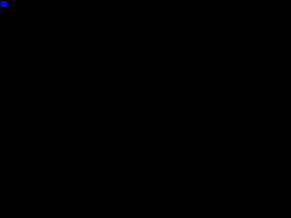
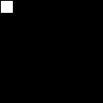

## Maze generation algorithms

This project provides Java implementations of more than 35 algorithms for generating so called "perfect mazes" (which are just spanning trees of undirected graphs).


On the web, many maze generation implementations in all possible programming languages can be found. The popularity of these algorithms probably comes from the fact that mazes and their creation processes are visually appealing and not really difficult to implement. The most popular algorithm seems to be "recursive backtracking" which is random depth-first traversal of a graph. 

On the other hand, there are only a few websites where the whole spectrum of maze creation algorithms is investigated. One prominent example is [this blog](http://weblog.jamisbuck.org/2011/2/7/maze-generation-algorithm-recap) where Jamis Buck presents the most popular maze algorithms together with Ruby/Javascript implementations. Reading his blog led myself to investigate this topic too.

Initially, I just intended to implement some of these algorithms to learn about the (then) new Java features (streams, lambda expressions). I also wanted to implement the needed data structures (graph, grid graph, union-find, ...) not just in an "ad-hoc" fashion. The maze algorithm implementations should become pure *graph algorithms* without any UI or animation related parts. The underlying algorithm, for example a minimum-spanning tree algorithm, should remain recognizable in the maze generator code. Avoiding dependencies to UI frameworks should help in making the code more reusable. For example, the animated GIF images below have been created using a grid graph observer which takes snapshots of the maze while being created. 

In the end, all the algorithms presented in Jamis Buck's blog and even some new algorithms got implemented. One new algorithm is a modification of Eller's algorithm that in contrast to the original doesn't generate the maze row-wise but from the center of the grid towards the outer borders. The resulting maze however is heavily biased. 

Other new algorithms are variations of Wilson's uniform spanning tree algorithm. They result from the different possibilities for selecting the random walk start cells. Because the order in which the random walk start cells are selected is arbitrary, there are lots of interesting choices: For example, one can start the random walks in the order defined by a space-filling curves like [Hilbert](https://github.com/armin-reichert/graph/tree/master/Graph/src/main/java/de/amr/graph/grid/curves/HilbertCurve.java), [Peano](https://github.com/armin-reichert/graph/tree/master/Graph/src/main/java/de/amr/graph/grid/curves/PeanoCurve.java) or [Moore](https://github.com/armin-reichert/graph/tree/master/Graph/src/main/java/de/amr/graph/grid/curves/MooreLCurve.java) curves. You can also use any other interesting pattern for filling a grid. In any case you'll get a visually appealing maze creation process.

Also implemented in this project are path finding algorithms for "solving" the generated mazes: "Breadth-First-Search" and "Depth-First-Search" together with their informed variants "Best-First-Search" and "Hill Climbing". For completeness, the A* and Dijkstra algorithms are also included. The Dijkstra algorithm however does not provide additional value because the graphs of the mazes have uniform edge cost.

The included [demo application](https://github.com/armin-reichert/mazes/releases/) demonstrates all implemented maze generators and path finders. Using a control panel you can interactively select the generation algorithm, path finder, grid resolution and rendering style ("walls", "passages").

In many implementations of maze generators a sharp differentiation is made between "wall builders" and "passage carvers" which I find slightly misleading. Interpreting a grid vertex as a "room" and a missing edge between two grid neighbors as a "wall" between them is just a matter of rendering the grid:


To achieve the mentioned goals, I implemented
- an API for [graph](https://github.com/armin-reichert/graph/tree/master/Graph/src/main/java/de/amr/graph/core/api/Graph.java) and [2D-grid](https://github.com/armin-reichert/graph/tree/master/Graph/src/main/java/de/amr/graph/grid/api/GridGraph2D.java) data structures 
- a space-efficient implementation of a [2D-grid](https://github.com/armin-reichert/graph/tree/master/Graph/src/main/java/de/amr/graph/grid/impl/GridGraph.java) with ability to store cell and edge content
- a publish-subscribe mechanism for observing graph/grid operations and different path finding algorithms.

This is the maze generator derived from Kruskal's minimum spanning tree algorithm:

```java
public class KruskalMST implements MazeGenerator<OrthogonalGrid> {

	private OrthogonalGrid grid;

	public KruskalMST(int numCols, int numRows) {
		grid = emptyGrid(numCols, numRows, UNVISITED);
	}

	@Override
	public OrthogonalGrid getGrid() {
		return grid;
	}

	@Override
	public OrthogonalGrid createMaze(int x, int y) {
		Partition<Integer> forest = new Partition<>();
		permute(fullGrid(grid.numCols(), grid.numRows(), UNVISITED).edges()).forEach(edge -> {
			int u = edge.either(), v = edge.other();
			if (forest.find(u) != forest.find(v)) {
				grid.addEdge(u, v);
				grid.set(u, COMPLETED);
				grid.set(v, COMPLETED);
				forest.union(u, v);
			}
		});
		return grid;
	}
}
```
Anybody familiar with the Kruskal algorithm will immediately recognize it in this code. The difference is that in the maze generator the edges of a (full) grid are selected in random  order where the original MST algorithm greedily selects the minimum cost edge in each step.

Implemented maze generation algorithms:

### Graph Traversal:

#### [Random Breadth-First-Search](MazeAlgorithms/src/main/java/de/amr/maze/alg/traversal/RandomBFS.java)


#### [Random Depth-First-Search, iterative](MazeAlgorithms/src/main/java/de/amr/maze/alg/traversal/IterativeDFS.java)


#### [Random Depth-First-Search, recursive](MazeAlgorithms/src/main/java/de/amr/maze/alg/traversal/RecursiveDFS.java)



### [Growing tree](MazeAlgorithms/src/main/java/de/amr/maze/alg/traversal/GrowingTree.java)

- [Growing tree (always first vertex selected)](MazeAlgorithms/src/main/java/de/amr/maze/alg/traversal/GrowingTreeAlwaysFirst.java)


- [Growing tree (always last vertex selected)](MazeAlgorithms/src/main/java/de/amr/maze/alg/traversal/GrowingTreeAlwaysLast.java)


- [Growing tree (always random vertex selected)](MazeAlgorithms/src/main/java/de/amr/maze/alg/traversal/GrowingTreeAlwaysRandom.java)


- [Growing tree (last or random vertex selected)](MazeAlgorithms/src/main/java/de/amr/maze/alg/traversal/GrowingTreeLastOrRandom.java)


### Minimum Spanning Tree:

#### [Boruvka](MazeAlgorithms/src/main/java/de/amr/maze/alg/mst/BoruvkaMST.java)


#### [Kruskal](MazeAlgorithms/src/main/java/de/amr/maze/alg/mst/KruskalMST.java)


#### [Prim](MazeAlgorithms/src/main/java/de/amr/maze/alg/mst/PrimMST.java)


#### [Reverse-Delete, base algorithm](MazeAlgorithms/src/main/java/de/amr/maze/alg/mst/ReverseDeleteMST.java)

  - [Reverse-Delete, DFS variant](MazeAlgorithms/src/main/java/de/amr/maze/alg/mst/ReverseDeleteMST_DFS.java)

  - [Reverse-Delete, BFS variant](MazeAlgorithms/src/main/java/de/amr/maze/alg/mst/ReverseDeleteMST_BFS.java)

  - [Reverse-Delete, Best FS variant](MazeAlgorithms/src/main/java/de/amr/maze/alg/mst/ReverseDeleteMST_BestFS.java)

  - [Reverse-Delete, Hill Climbing variant](MazeAlgorithms/src/main/java/de/amr/maze/alg/mst/ReverseDeleteMST_HillClimbing.java)


### Uniform Spanning Tree:

#### [Aldous-Broder](MazeAlgorithms/src/main/java/de/amr/maze/alg/ust/AldousBroderUST.java)



#### [Houston](MazeAlgorithms/src/main/java/de/amr/maze/alg/ust/AldousBroderWilsonUST.java)

#### [Wilson's algorithm](MazeAlgorithms/src/main/java/de/amr/maze/alg/ust) (16 different variants)


### Other algorithms:

#### [Binary Tree, top-to-bottom](MazeAlgorithms/src/main/java/de/amr/maze/alg/BinaryTree.java)


#### [Binary Tree, random](MazeAlgorithms/src/main/java/de/amr/maze/alg/BinaryTreeRandom.java)


#### [Eller's algorithm](MazeAlgorithms/src/main/java/de/amr/maze/alg/Eller.java)


#### [Armin's algorithm](MazeAlgorithms/src/main/java/de/amr/maze/alg/Armin.java) (like Eller's but growing the maze inside-out)


#### [Sidewinder](MazeAlgorithms/src/main/java/de/amr/maze/alg/Sidewinder.java)


#### [Hunt-And-Kill, top-to-bottom](MazeAlgorithms/src/main/java/de/amr/maze/alg/HuntAndKill.java)


#### [Hunt-And-Kill, random](MazeAlgorithms/src/main/java/de/amr/maze/alg/HuntAndKillRandom.java)


#### [Recursive division](MazeAlgorithms/src/main/java/de/amr/maze/alg/RecursiveDivision.java)


### Path finding algorithms:
The [graph](https://github.com/armin-reichert/graph) library contains the following path finder implementations:
- [Breadth-First-Search](https://github.com/armin-reichert/graph/tree/master/Graph/src/main/java/de/amr/graph/pathfinder/impl/BreadthFirstSearch.java)
- [Depth-First-Search](https://github.com/armin-reichert/graph/tree/master/Graph/src/main/java/de/amr/graph/pathfinder/impl/DepthFirstSearch.java)
- [(Greedy) Best-First-Search](https://github.com/armin-reichert/graph/tree/master/Graph/src/main/java/de/amr/graph/pathfinder/impl/BestFirstSearch.java).
- [Hill Climbing](https://github.com/armin-reichert/graph/tree/master/Graph/src/main/java/de/amr/graph/pathfinder/impl/HillClimbingSearch.java).
- [A* Search](https://github.com/armin-reichert/graph/tree/master/Graph/src/main/java/de/amr/graph/pathfinder/impl/AStarSearch.java).
- [Dijkstra](https://github.com/armin-reichert/graph/tree/master/Graph/src/main/java/de/amr/graph/pathfinder/impl/DijkstraSearch.java).

 The "informed" path finders can be used with Euclidean, Manhattan and Chebyshev distance heuristics.
